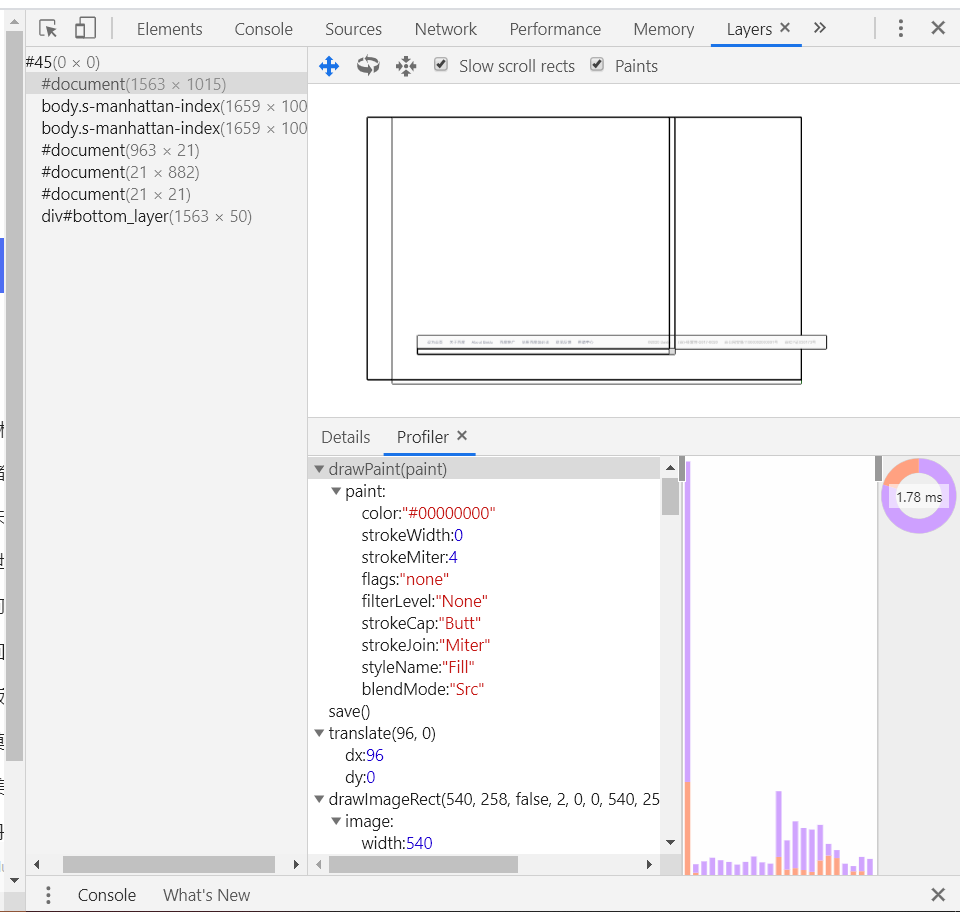

# 资源渲染

渲染过程包括四个步骤：

1. 构建图层树
2. 生成`绘制列表`
3. 生成`图块` 和 `栅格化`
4. 显示到显示器
## 构建图层树

前面已经生成，DOM树和样式以及位置，那么是否可以直接开始渲染了呢？如果你觉得可以，那么你就错了。

思考一下：一个3D动画怎么来呈现出变化效果呢？当含有叠层上下文时，如何控制显示和隐藏呢？

为了解决上述的问题，浏览器在生成布局树后，还会对特点的节点进行分层，构建一棵`图层树`。

节点的图层会默认属于父节点的图层。节点还有可能会提升为单独的合成层。
有两种情况：

1. 显示合成

显示合成的情况：

一、拥有`叠层上下文`的节点。

层叠上下文也基本上是有一些特定的CSS属性创建的，一般有以下情况:

   1. HTML根元素本身就具有层叠上下文。
   2. 普通元素设置position不为static并且设置了z-index属性，会产生层叠上下文。
   3. 元素的 opacity 值不是 1
   4. 元素的 transform 值不是 none
   5. 元素的 filter 值不是 none
   6. 元素的 isolation 值是isolate
   7. will-change指定的属性值为上面任意一个。(will-change的作用后面会详细介绍)
二、需要剪裁的地方。

比如一个div，你只给他设置 100 * 100 像素的大小，而你在里面放了非常多的文字，那么超出的文字部分就需要被剪裁。
当然如果出现了滚动条，那么滚动条会被单独提升为一个图层。

2. 隐式合成
`隐式合成`，一个节点被提升为一个单独的图层后，所有比它层叠等级高的节点都会成为一个单独的图层。

这个隐式合成其实隐藏着巨大的风险，如果在一个大型应用中，当一个z-index比较低的元素被提升为单独图层之后，层叠在它上面的的元素统统都会被提升为单独的图层，可能会增加上千个图层，大大增加内存的压力，甚至直接让页面崩溃。

## 生成绘制列表

接下来，渲染引擎会将图层绘制拆分成一个个绘制指令，比如说：先画背景图，再画边框...然后将这些绘制指令组合成一个绘制列表，为后面的绘制操作做好安排。

拿百度首页来说，打开百度首页，再开打控制台，点击more tools里的Layers，就可以看到下面的绘制列表：

## 生成图块和位图

接着就是绘制操作，有一个专门独立负责绘制的线程，叫作合成线程。绘制列表准备好后，渲染引擎会让主线程给合成线程`commit`一个消息。
把绘制列表发送给合成线程。接着合成线程就开始进行操作。

首先，我们考虑一个问题，视口就这么大如果加载一个很大的页面，如果一次性加载出来将非常浪费性能的。此时合成线程要做的第一件事就是
将绘制列表分块。这些块一般的规格为：256*256，512*512，这样就大大提升了页面的加载速度。

因为后面的图块要进入GPU，考虑到浏览器内存上传到GPU的操作比较慢，即使是绘制一小块图块也是相当耗时的。所以chorme采用了一个优化：
在首次加载时，使用低分辨率的图片，这时候继续合成，当正常的图块加载出来后再替换掉。

渲染进程中专门维护了一个**栅格化线程池**，用于将图块转成位图数据。

合成线程会选择视口附近的图块交给栅格化线程池。

生成位图的过程实际上都会使用GPU进行加速，生成的位图最后发送给合成线程。

## 显示器显示

合成线程生成绘制指令后，会发送给浏览器进程。浏览器进程中的viz组件接收到这个指令后，根据这个指令生成页面内容并存到内存中，也就是生成了页面。
然后将这个页面发送给显卡？为什么要发送给显卡，这时候就要讲一下显卡的显示原理了。

不管时PC还是手机屏幕，都有一个固定的刷新频率即60HZ，也就是一秒刷新60张图片，也就是说一张图片显示大约16.67ms。
而每次更新的图片都是来自显卡的前缓冲区。显卡在接收到浏览器进程传来的内容后，会合成相应的图像存在后缓冲区。
然后，系统自动将`前缓冲区`和`后缓冲区`对换位置，如此循环更新。
