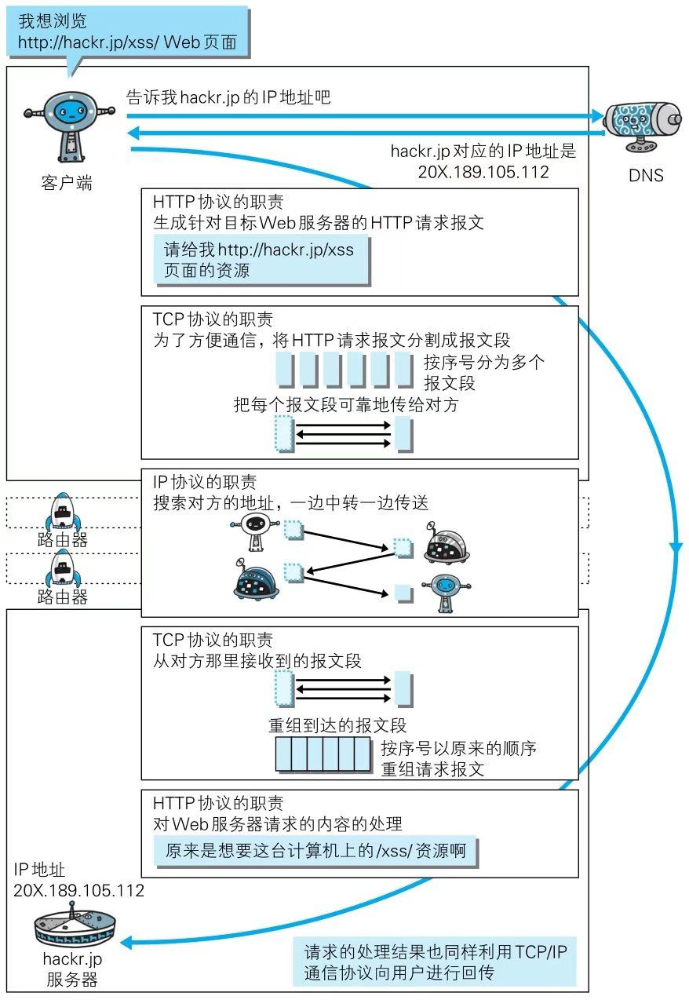

# 1.网络基础

## 1.1 TCP/IP

通常使用的网络（包括互联网）都是基于TCP/IP协议族的，而HTTP属于它内部的一个子集。

### 1.1.1 TCP/IP协议族

计算机双方要通信，那么就必须**约定相同的规则**。比如，如何探测到通信目标、由哪一边发起通信、使用哪种语言进行通信、怎么结束通信等等规则。
以及不同的硬件、操作系统直接的通信，这些都需要一种规则。我们通常把这样的规则称为**协议**

TCP/IP协议族是互联网相关联的协议集合起来总称为TCP/IP。

### 1.1.2 TCP/IP的分层管理

+ 应用层：
  应用层决定了**提供用户应用服务**时的通信活动。TCP/IP协议族内有各类通用的应用服务。HTTP协议处于该层。

+ 传输层：
  传输层给应用层提供两台处于网络连接的计算机之间的**数据传输**。在传输层中有两个协议：TCP（传输控制协议）、UDP（用户数据报协议）

+ 网络层：
  负责**处理网络中流动的数据包**。数据包是网络传输中最小的单位。该层规定了两台计算机通信的路线，并把数据包送达到对方。

  就是通过多台计算机或者网络设备（路由器）进行传输时，网络层负责在众多的选项中**选择一条传输路线**。

+ 数据链路层：
  链路层负责处理连接网络双方的硬件部分，比如控制操作系统、硬件的设备驱动、NIC(网络适配器即网卡)以及光纤等物理媒介。

### 1.1.3 TCP/IP 通信传输流
TCP/IP协议族进行通信的时候会按照分层的顺序与对方进行通信，发送端由应用层往链路层，接收端由链路层往应用层。

拿HTTP作为例子：
 1. 应用层（HTTP）：发送端的客户端发起一个HTTP请求
 2. 传输层（TCP）：把HTTP请求报文进行分割，并在个报文打上标记序号和端口号，然后转发给网络层
 3. 网络层（IP）：增加目的地MAC地址，转发给链路层

发送端在层与层之间传输数据时，每经过一层必定会被打上该层的首部信息。接收端会一层一层消除。

## 1.2 IP、TCP、DNS

### 1.2.1 IP

IP属于网络层

IP作用是把各种数据包传输到对方。确保传输正确需要满足各类条件。

其中两个重要条件：IP地址（配送地址）和MAC地址（网卡固定地址）。

ARP协议是一种能通过IP地址解析出MAC地址的TCP/IP协议。

### 1.2.2 TCP

TCP属于传输层，提供可靠的字节流服务。

字节流服务就是为了方便传输，将大数据分割成报文段为单位的数据包进行管理。

为了准确无误的将数据送到目的处。TCP协议采用三次握手的策略。握手过程中用了TCP的标志————SYN和ACK。

1. 发送端：首先发送一个带有SYN标志的数据包。处于SYN_SEND状态。
2. 客户端：接收到后，发送一个SYN/ACK包以表示确认收到。处于SYN-RCVE状态。
3. 发送端：最后，发送端再返回一个ACK包，代表握手结束。处于ESTABLELISED状态。

### 1.2.3 DNS

位于应用层

作用的是提供域名与IP地址之间的解析服务

## 1.3 各协议与HTTP协议的关系

