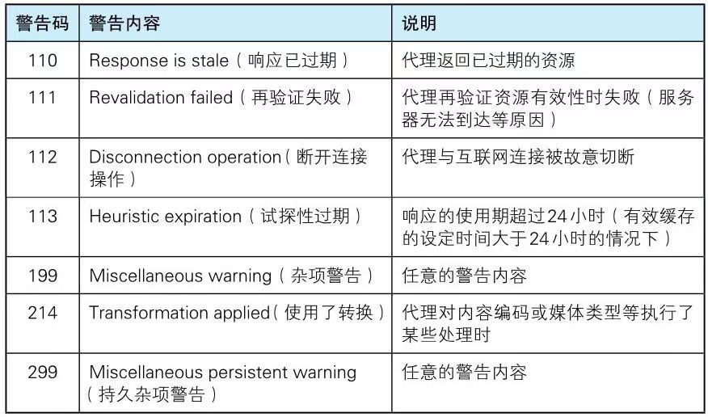

# 2. HTTP协议

## 2.1 HTTP报文的构成

### 2.1.1 请求报文
请求头：请求方法 + 请求URI + 协议版本
请求首部字段

内容实体

例如
```
POST /form/entry HTTP/1.1
Host: www.baidu.com
Connection: keep-alive
Content-Type: applicecation/x-www-form-urlencoded
Content-Length: 16

name=useo&age=37
```

### 2.1.2 响应报文
响应头：协议版本 状态码 状态码的原因短语
响应首部字段

内容实体

例如
```
HTTP/1.1 200 OK
Date: Tue, 10 Jul 2012 06:50:15 GMT
Content-Type: text/html
Content-Length: 362

<html>...</html>
```
 
## 2.2 HTTP报文首部字段
分为4种类型：

### 2.2.1 通用首部字段

1. Cache-Control

Cache-Control 操作缓存的工作机制

指令：

+ public: 其他用户也可利用缓存
+ private: 只给特定的用户缓存
+ no-cache: 防止从缓存中返回过期内容，不进行缓存
+ no-store: 暗示请求或响应中包含机密信息，不缓存。
+ s-maxage: 指定缓存有效期，供给多位用户使用的供给缓存服务器使用，使用后直接忽略Expires、max-age
+ max-age: 指定缓存有效期，使用后忽略Expires
+ min-fresh: 在指定时间以内如果有超过有效期限的资源都无法返回
+ max-stale: 在指定时间以内接收过期的缓存资源。
+ only-if-cached: 仅在缓存服务器本地缓存目标资源的情况下才返回。
+ must-revalidate: 代理会向源服务器再次验证即将返回的响应缓存目前是否有效。
+ proxy-revalidate: 要求缓存服务器在接收到客户端请求，返回响应之前，必须再次验证缓存的有效性
+ no-transform: 保证缓存不能改变实体主体的媒体类型。防止缓存或代理压缩图片。

2. Connection
作用：
+ 控制不再转发给代理的首部字段
```
Upgrade: HTTP/1.1
Connection: Upgrade 不再转发的首部字段名
```
+ 管理持久连接
```
Connection: close
```
```
Connection: keep-alive
```
Http/1.1版本之前都是非持久连接的，如果需要开启持久连接要加上 Connection: keep-alive

3. Pragma 

要求中间服务器不返回缓存的资源

4. Trailer

事先说明在报文主体后记录了哪些字段。该首部字段可应用于HTTP/1.1分块传输编码时

5. Transfer-Encoding

传输报文主体时采用的编码方式。
HTTP/1.1的传输编码方式仅对分块传输编码有效。

```
Transfer-Encoding: chunked
```

6. Upgrade 

用于检测HTTP协议以及其他协议是否可用更高的版本

```
Upgrade: HTTP/1.1
Connection: Upgrade
```
Upgrade仅限于客户端和邻接服务器之间，所以要额外指定Connection: Upgrade

7. Via

是为了追踪客户端与服务端之间请求和相遇报文的传输路径,还可以避免请求回环的发生。
所以必须在经过代理时使用。

```
Via：1.0 gw. hackr.jp(Squid/3.1)
```

8. Warning

告知与缓存相关的问题的警告

```
Warning:[警告码][警告的主机：端口号]"[警告内容]"([日期])
```

HTTP/1.1 7种警告码



### 2.2.2 请求首部字段

1. Accept

告诉服务器，客户端能够处理的媒体类型以及优先级
```
Accept: text/plain; q=0.3, text/html
```

+ 文本文件：
text/html,text/plain,text/css ...

application/xhtml+xml,application/xml...

+ 图片文件：
image/jpeg,image/gif,image/png ...

+ 视频文件

video/mpeg,video/quick-time ...

+ 二进制文件
application/octet-stream,application/zip

若要给媒体类型增加优先级，使用q=表示，范围时0~1

2. Accept-Charset

通知服务器用户代理支持的字符集以及优先级

3. Accept-Encoding

支持的内容编码以及内容编码的优先级顺序

+ gzip: 由文件压缩程序gzip生成的编码格式
+ compress: 有UNIX文件压缩程序compress生产的编码格式
+ deflate: 组合使用zlib格式和有deflate压缩算法生成的编码格式
+ 不执行压缩或不会变化的默认编码格式

4. Accept-Language

支持的自然语言集
```
Accept-Language: zh-cn,zh;q=0.7,en-us,en;q=0.3
```

5. Authorization

用来告知服务器，用户代理的认证信息。

6. Expect
告知服务器，期望出现的某种特定行为。

```
Expect: 100-continue
```

7. From

告知使用代理的用户的电子邮件。

8. Host

请求服务器的主机名和端口号（必须）。

9. If-Match

服务器会对比If-Match的字段值和资源的Etag值，仅两者一致的时候，才会执行请求。反之，状态码返回412。

10. If-None-Match

与If-Match相反，服务器会对比If-None-Match的字段值和资源的Etag值，仅两者不一致的时候，才会执行请求

11. If-Modified-Since

如果在If-Modified-Since字段指定的日期时间后，资源发生更新，服务器会接受请求。
如果请求的资源没有更新，则返回304状态码。
服务器可通过Last-Modified来确定。

12. If-UnModified-Since

如果在If-unModified-Since字段指定的日期时间后，资源未发生更新，服务器会接受请求。
如果发生了更新，则返回412状态码。

13. If-Range

如果与Etag值一致，则返回指定范围内的资源，否则返回全部资源。

14. Max-ForWords

可以转发的最大次数。

15. Proxy-Authorization

告知代理服务器所需要的认证信息。

16. Range

对于只需获取部分资源的范围请求，成功之后返回206状态码

17. Referer

告知服务器请求的原始资源的URI

18. TE

告知服务器传输编码格式

还可以指定trailers字段的分块传输编码的方式。

19. User-Agent

用于传达浏览器的种类

### 2.2.3 响应首部字段

1. Accpect-Ranges

是否能处理范围请求，可处理则传bytes否则传none.

2. Age

告知客户端，响应在多久前创建的。
如果响应是缓存服务器创建的，则是指缓存后的响应再次发起认证到认证完成的时间值。

3. ETag

实体标识。

强ETag值：无论发生多么细的变化都会更新

弱ETag值：发生根本变化才会更新，在最开始出加上W/

4. Location

使用首部字段Location表示资源已经被转移到另一个URI了

5. Proxy-Authenticate

首部字段Proxy-Authenticate会把由代理服务器所要求的认证信息发送给客户端

6. Retry-After 

首部字段Retry-After告知客户端应该在多久之后再次发送请求

7. Server

首部字段Server告知客户端当前服务器上安装的HTTP服务器应用程序的信息

8. Vary

当代理服务器接收到带有Vary首部字段指定获取资源的请求时，如果使用的Accept-Language字段的值相同，那么就直接从缓存返回响应。反之，则需要先从源服务器端获取资源后才能作为响应返回

9. WWW-Authenticate

首部字段WWW-Authenticate用于HTTP访问认证。它会告知客户端适用于访问请求URI所指定资源的认证方案（Basic或是Digest）和带参数提示的质询（challenge)

### 2.2.4 实体首部字段

1. Allow

用于通知客户端，服务器所能支持的HTTP方法。
当收到不支持的方法时，返回405.

2. Content-Encoding

告知客户端，服务器对实体选用的内容编码方式。主要的内容编码有四种：gzip/compress/deflate/identity

3. Content-Language

告知客户端实体使用的自然语言

4. Content-Length

告知客户端实体的部分的大小（单位字节）。如果对实体进行内容编码则不能使用Content-Length首部字段。

5. Content-Location

表示的是报文主体返回资源对应的URI
```
Content-Location: http://www.hackr.jp/index.ja.html
```
6. Content-MD5

一串MD5算法生成的值，用于检查报文主体传输过程中是否保持完整，以及确认送达。

作为接受方会再执行一次相同的MD5算法，进行判断出报文主体的准确性。

7. Content-Range

告知客户端作为响应返回的实体哪个部分符合范围请求。

```
Content-Range: bytes 5001-10000/10000
```

8. Content-Location

说明了实体主体内对象的媒体类型

9. Expires

将资源失效的日期告知客户端，相比会优先处理Cache-Control:max-age

10. Last-Modified

指明资源最终修改的时间。


### 2.2.6 其他首部字段

1. X-Frame-Options
```
X-Frame-Options: DENY
```
属于响应首部，用于控制网站内容在其他Web网站的Frame标签的显示问题。

+ DENY: 拒绝
+ SAMEORIGIN: 仅在同源域名下的页面匹配时许可。

2. X-XSS-protection

属于响应首部，用于控制浏览器XSS防护机制的开关
+ 0： 无效状态
+ 1： 有效状态

3. DNT

属于请求首部，DNT意为拒绝个人信息被收集，是拒绝被精准广告追踪的一种方法。
+ 0： 同意
+ 1: 拒绝

## 2.3 HTTP无状态

HTTP是不保存状态的协议即无状态协议。

为了更快的处理大量的事务，确保协议的可伸缩性，而特意把HTTP设计成如此简单。

无状态缺点：用户登录到一家购物网站，即使他跳到该网站的其他页面也要保持登录状态，如果无状态的话那么每到一个页面都要重新登录。
针对这种情况就需要保存用户的状态。

HTTP/1.1虽然是无状态的，但是为了实现保存状态，于是引入的cookie技术。有了cookie在用HTTP协议通信就可以管理状态了。

## 2.4 HTTP方法

GET：获取资源
POST：传输实体主体
PUT:传输文件。该方法任何人都可以上次文件，存在安全性问题。除非使用验证机制或REST标准，就可能开发使用。
HEAD: 获取报文首部
DELETE：删除资源
OPTIONS: 询问支持的方法
TRACE: 追踪路径
CONNECT:要求用隧道协议连接代理

## 2.5 HTTP持久连接

HTTP初始版本每通信一次都要断开一次TCP，随着HTTP的普及，文档中包含着大量图片。
比如一个浏览器浏览多张图片的HTML页面，在发送HTML页面资源的同时，也会请求该HTML页面里的其他资源。
因此，每次的请求都会造成无谓的TCP建立和断开
增加通信量的开销。

### 2.4.1 特点

1. 一方没有提出断开连接，则保持TCP连接状态
2. 在HTTP/1.1 默认持久连接。

## 2.6 压缩提升传输速率

常用的内容编码如下：

+ gzip(GUN zip)
+ deflate(zlib)
+ identity(不编码)

## 2.7 发送多种数据的多部分集合

多部分对象集合包含的对象如下：

+ Content-Type: multipart/form-data: 在web表单上传时使用
+ Content-Type: multipart/byteranges：响应报文包含了多个范围的内容时使用

## 2.8 范围请求

```
Range: bytes= 5001-6000
```

## 2.9 内容协商

当浏览器默认语言为英文或中文，访问相同URI的web页面时，则会显示对于的英文或中文版页面。这样的机制称为内容协商。
协商类型：服务器协商、客户端协商、透明协商（服务端、客户端混合）

以下首部字段就是判断的基准

Accept:
Accept-Charset:
Accept-Encoding:
Accept-Language:

## 2.10 HTTP 状态码

### 1xx
  请求正在处理

### 2xx：请求成功
  200: 客户端请求被服务端成功处理并返回数据。
  204：客户端请求被服务端成功处理但未返回数据。
  206：客户端使用Content-Range进行范围请求，被服务端成功处理并返回数据。

### 3xx: 重定向
  301：永久重定向，表示资源已经被分配了新的URL
  302：临时重定向，表示资源临时分配到了新的URL
  303：表示资源存在着另一个URL，需要用GET方法请求
  304：表示协商缓存命中时，返回该状态码
  307：临时重定向

### 4xx: 客户端错误
  400：表示客户端请求地址或者请求参数错误
  401：表示发送的请求需要通过HTTP认证的认证信息
  403：表示请求被服务器拒绝。
  404：表示服务器没有找到该资源
  405：表示服务器不接受该请求方法

### 5xx: 服务端错误
  500：表示服务端执行请求时发生了错误
  503：表示服务器暂时处于超负荷或停止服务

