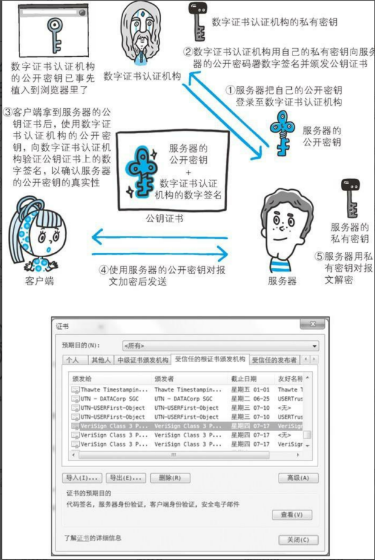
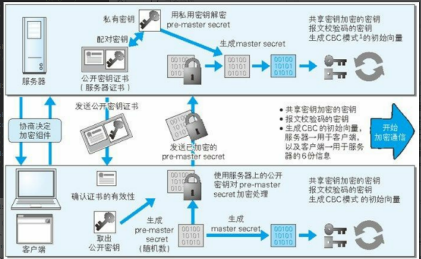

# https

## http的缺点

1. 使用明文通信（不加密），容易被窃取信息
2. 不验证通信方的身份，因此容易被伪装
3. 无法证明报文的完整性，所以有可能已遭篡改

## http + 加密 + 认证 + 完整性保护 = https

加密及认证机制的HTTP称为HTTPS（HTTP Secure）.

HTTPS只是HTTP**通信接口部分**用SSL（安全套接层）和TLS（传输层安全）协议代替而已。

通常HTTP直接和TCP通信。当使用SSL时，则演变成先和SSL通信，再由SSL通信。

### SSL

SSL采用一种叫做公开密匙加密的加密处理方式

+ 共享密钥加密

加密和解密同用一个密钥的方式称为共享密钥加密，也被叫做对称密钥加密。

困境：任何人只要持有密钥就能解密了。如果密钥被攻击者获得，那加密也就失去了意义。

+ 公开密钥加密方式

公开密钥加密使用一对非对称的密钥。一把叫做私有密钥（private key），另一把叫做公开密钥（public key）。

使用公开密匙的方式，发送密文的一方使用对方的公开密匙进行加密处理，对方收到被加密的信息后，再使用自己的私有密匙进行解密。

+ HTTPS 采用混合加密机制

HTTPS 采用共享密钥加密和公开密钥加密两者并用的混合加密机制

在交换密钥环节使用公开密钥加密方式，之后的建立通信交换报文阶段则使用共享密钥加密方式

公开密钥加密方式还是存在一些问题的。那就是无法证明公开密钥本身就是货真价实的公开密钥

+ 证明公开密匙的正确性

为了解决上述问题，可以使用由数字证书认证机构（CA,Certificate Authority）和其相关机关颁发的公开密钥证书。

数字证书认证机构处于客户端与服务器双方都可信赖的第三方机构的立场上，威瑞信（VeriSign）就是其中一家非常有名的数字证书认证机构

数字证书认证机构的业务流程：
1. 公开密匙的申请
2. 确认申请者身份，对已申请的公开密匙做数字签名
3. 分配已签名的公开密匙，并将该公开密匙放入公匙证书后绑定在一起。

服务器申请到证书后会发给客户端

客户端接到证书后，会对证书上的签名进行验证，一旦验证通过，客户端可明确两件事：

1. 证书机构是真实有效的
2. 服务器的公开密钥是值得信赖的

+ 可证明组织真实性的 EV SSL 证书

证书的作用:
1. 证明作为通信一方的服务器是否规范，
2. 可确认对方服务器背后运营的企业是否真实存在。 

拥有该特性的证书就是 EV SSL证书（扩展验证 SSL 证书）。

## https 的安全通信机制

1. 客户端: 发送 **Client Hello** 报文开始 SSL通信。报文中包含客户端支持的 **SSL的指定版本**、**加密组件**（Cipher Suite）列表（所 使用的加密算法及密钥长度等）。 

2. 服务器: 可进行 SSL通信时，会以 **Server Hello** 报文作为应答。在报文中包含 **SSL版本以及加密组件**。服务器的加密组件内容是从接收到的客户端加密组件内筛选出来的。 

3. 服务器: 发送 **Certificate** 报文。报文中包含**公开密钥证书**。

4. 服务器: 发送 **Server Hello Done** 报文通知客户端，最初阶段的 SSL握手**协商部分结束**。 

5. 客户端: SSL第一次握手结束之后，以 **Client Key Exchange** 报文作为回应。报文中包含通信加密中使用的一种被称为 **Pre-master secret 的随机密码串**。该报文已用步骤 3 中的公开密钥进行加密。 

6. 客户端: 发送 **Change Cipher Spec** 报文。该报文会提示服务器，**在此报文之后的通信**会采用 **Pre-master secret 密钥加密**。 

7. 客户端: 发送 **Finished** 报文。该报文包含**连接至今全部报文的整体校验值**。这次握手协商**是否能够成功**，要以**服务器**是否能够**正确解密**该报文作为判定标准。 

8. 服务器: 同样发送 **Change Cipher Spec** 报文。 

9. 服务器: 同样发送 **Finished** 报文。 

10.  SSL连接就算建立完成。当然，通信会受到 SSL的保护。从此处开始进行应用 层协议的通信，即发送 HTTP 请求。 

11. 应用层协议通信，即发送 HTTP 响应。 

12. 最后由客户端断开连接, 发送 close_notify 报文。这步之后再发送 TCP FIN 报文来关闭与 TCP 的通信。 

在以上流程中，应用层发送数据时会附加一种叫做 **MAC**（Message Authentication Code）的报文摘要。MAC 能够查知报文**是否遭到篡改**，从而**保护报文的完整性**。 

以下是服务器使用公开密钥证书建立https通信的整个过程

+ SSL 和 TLS

IETF 以 SSL3.0 为基准，后又制定了 TLS1.0、TLS1.1 和 TLS1.2。TSL是以 SSL为原型开发的协议，有时会统一称该协议 为 SSL。当前主流的版本是 SSL3.0 和 TLS1.0。

+ SSL 速度慢吗?

HTTPS 也存在一些问题，那就是当使用 SSL时，它的处理速度会变慢.

1. 通信慢

2. 大量消耗 CPU 及内存等资源，导致处理速度变慢。