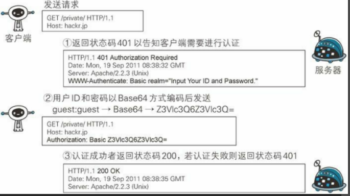

# http 认证方式

## BASIC 认证

缺点：Base64明文解码后就是用户ID和密码，就可以窃取。

## DIGEST 认证

所谓质询响应方式是指，一开始一方会先发送认证要求给另一方，接着使用从另一方那接收到的质询码计算生成响应码。最后将响应码返回给对方进行认证的方式。

## SSL 客户端认证

SSL客户端认证是通过HTTPS的客户端证书来完成认证的。

### 步骤

1. 服务器：接受到需要认证资源的请求，会发送**Certificate Request**报文，要求客户端提供客户端证书。

2. 客户端：将证书以**client Certificate**报文方式发送给服务器。

3. 服务器：证书验证通过，可以取到证书里的公开密钥，然后开始HTTPS加密通信。