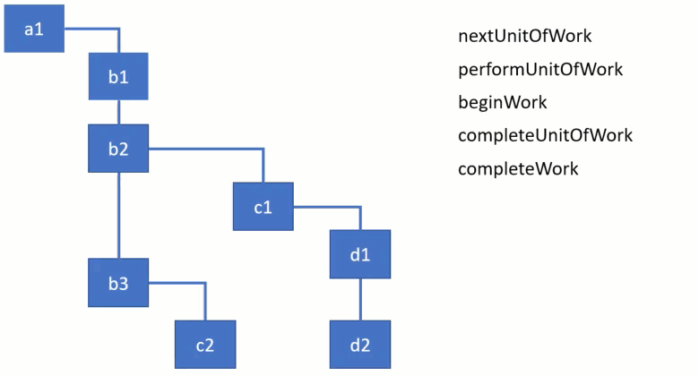

# 深入了解React中的新协调算法

了解新协调算法的两个主要阶段。详细了解React如何更新状态、`props` 和处理子级。

React是一个用于构建用户界面的JavaScript库。其核心是跟踪组件状态变化并将更新后的状态投影到屏幕的机制。在React中，我们将此过程称为和解。当调用`setState`方法时框架会去检查`state`或`props`是否已更改，如果更改了会重新渲染组件。

React的文档提供了一份很不错的[实现 React 的 “diffing” 算法过程中所作出的设计决策概述](https://zh-hans.reactjs.org/docs/reconciliation.html)：React元素的作用、生命周期方法和`render`方法，以及应用于组件子级的diffing算法。从`render`方法返回的不可变的React元素树通常称为“virtual DOM”。这个术语有助于解释早期的React，但它也容易让人混淆，因此不要再在React其他的文档中继续使用它。在本文中，将称之为React元素树。

除了React元素树之外，框架始终有一个用于保存状态的内部实例树（组件、DOM节点等）。从版本16开始，React推出了该内部实例树的新实现，并将它的算法，称为`Fiber`。

## 示例

下面实现是一个简单的例子。功能是这样的，有一个按钮，可以简单地增加屏幕上显示的数字：

```js
class ClickCounter extends React.Component {
    constructor(props) {
        super(props);
        this.state = {count: 0};
        this.handleClick = this.handleClick.bind(this);
    }

    handleClick() {
        this.setState((state) => {
            return {count: state.count + 1};
        });
    }


    render() {
        return [
            <button key="1" onClick={this.handleClick}>Update counter</button>,
            <span key="2">{this.state.count}</span>
        ]
    }
}
```
这是一个简单的组件，从`render`方法返回两个子元素`button`和`span`。

只要单击按钮，组件的状态就会更新。然后`span`元素的文本也随之更新。React在协调期间执行各种活动。下面是React在这个例子中首次渲染期间和状态更新后执行的优先级高的操作：

+ 更新`ClickCounter`组件`state`中的`count`属性

+ 检索并比较`ClickCounter`的子级及其`props`

+ 更新`span`元素的`props`

在**协调期间**还执行了其他活动，如调用[生命周期方法](https://zh-hans.reactjs.org/docs/react-component.html)或更新[refs](https://zh-hans.reactjs.org/docs/refs-and-the-dom.html)。**这些活动在fiber架构中统称为“work”**。`work`类型通常取决于react元素的类型。例如，对于`class`组件，React需要创建一个实例，而对于`function`组件则不需要创建实例。

我们都知道，React中有多种元素，例如 `class` 和`function`组件、`host` 组件（DOM节点）、` portals`等。React元素的类型由`createElement`函数的第一个参数定义。此函数通常在`render`方法中用于创建元素。

在我们开始研究`fiber`主要算法之前，让我们先熟悉`React`内部使用的数据结构。

## React 元素转成 Fiber 节点

React中的每个组件都有一个UI表现形式，我们可以调用 `render` 方法来返回视图或模板。这是`ClickCounter` 组件的模板：

```js
<button key="1" onClick={this.onClick}>Update counter</button>
<span key="2">{this.state.count}</span>
```

## React 元素

一旦模板通过JSX编译，就会得到一堆React元素。其实，`render`方法返回的内容只是react组件并不是HTML。因此我们不一定要使用JSX，也可以将`ClickCounter`组件的`render`方法这样重写：

```js

class ClickCounter {
    ...
    render() {
        return [
            React.createElement(
                'button',
                {
                    key: '1',
                    onClick: this.onClick
                },
                'Update counter'
            ),
            React.createElement(
                'span',
                {
                    key: '2'
                },
                this.state.count
            )
        ]
    }
}
```

在`render`方法中调用`React.createElement`后会创建像下面这样的数据结构：

```js
[    
  {
        $$typeof: Symbol(react.element),
        type: 'button',
        key: "1",
        props: {
            children: 'Update counter',
            onClick: () => { ... }
        }
    },
    {
        $$typeof: Symbol(react.element),
        type: 'span',
        key: "2",
        props: {
            children: 0
        }
    }
]
```
可以看到，React将属性`$$typeof`添加到这些对象中，来标识唯一的React元素。
然后用属性`type`，`key` 和`props` 来描述元素。这些值取自传递给`React.createElement`函数的值。
注意观察，React如何将文本内容`span`和`button`变成一个子节点。以及点击事件是如何成为`button`元素属性的一部分的。React元素上还有其他字段，如ref字段（这不在本文的讨论范围）。

`ClickCounter`的React元素没有任何`props`或`keys`：

```js
{
  $$typeof: Symbol(react.element),
  key: null,
  props: {},
  ref: null,
  type: ClickCounter
}
```

## Fiber 节点

在协调过程中，`render`方法返回的每个React元素的数据都会被合并到fiber节点树中。每个React元素都有一个对应的fiber节点。与React元素不同，`fibers` 不会在每次渲染时重新创建。它们是能够保存住组件状态和DOM的可变数据结构。

之前讨论过，根据React元素的类型，框架需要执行不同的活动。在开始的示例中，对于类组件`ClickCounter`，它调用了生命周期方法和`render`方法，而对于`span` host组件（DOM节点）执行 DOM `mutation`。因此，每个React元素都被转换为[相应类型](https://github.com/facebook/react/blob/769b1f270e1251d9dbdce0fcbd9e92e502d059b8/packages/shared/ReactWorkTags.js)的Fiber节点，来表示需要完成的工作。

可以将fiber视为一种数据结构，它表示要做一些工作，或者换句话说，一个工作单元。firber的体系结构还提供了一种方便的方式来跟踪、调度、暂停和中止工作。

当React元素首次转换为fiber节点时，React使用的数据是来自元素在[`createFiberFromTypeAndProps`](https://github.com/facebook/react/blob/769b1f270e1251d9dbdce0fcbd9e92e502d059b8/packages/react-reconciler/src/ReactFiber.js#L414)函数中创建的fiber。在随后的更新中，React重用fiber节点，只要更新相应的React元素的必要属性。

React还会根据`key`属性移动树中的节点，或者删除`render`方法中无法返回相应数据的React元素。

:::tip
查看[ChildReconciler](https://github.com/facebook/react/blob/95a313ec0b957f71798a69d8e83408f40e76765b/packages/react-reconciler/src/ReactChildFiber.js#L239)函数，来看一下React现有fiber节点执行的所有活动和相应函数的列表。
:::tip

因为React给每个React元素创建了一个fiber，因此会有一颗元素树和一颗fiber节点树。


所有fiber节点都通过自身的属性（child、sibling和return）连接成一个链表。

可以通过阅读[《React在Fiber中使用链表的方式和原因》](https://medium.com/dailyjs/the-how-and-why-on-reacts-usage-of-linked-list-in-fiber-67f1014d0eb7)，了解更多关于它为什么会这样工作。

## 当前树 和 进程树

在第一次渲染之后，React最终得到一个用于渲染应用程序用户界面状态的fiber树。此树通常称为**当前树**。当React开始处理更新时，它会构建一个所谓的 **workInProgress 树**，它表示要接下来要刷新到屏幕上的状态。

所有工作都在`workInProgress`树中的fiber上执行。当React遍历当前树时，它会为每个现有fiber节点创建一个用于构成`workInProgress`树的备用节点。此节点是使用render方法返回的React元素中的数据创建的。一旦更新处理完毕，所有相关工作都完成了，React将得到一个可以刷新到屏幕上的备用树。在屏幕上渲染此`workInProgress`树后，它将成为当前树。

React的核心原则之一是一致性。React总是一次性更新DOM ——— 它不会显示部分结果。`workInProgress`树就像一个用户看不到的草稿，因此React可以先处理所有组件，然后将其更改刷新到屏幕。

在源代码中，您将看到许多函数从当前树和`workInProgress`树中获取fiber节点。像这样的函数：

```js
function updateHostComponent(current, workInProgress, renderExpirationTime) {...}
```

## 副作用

我们可以把React中的组件看作通过`state`和`props`计算用户界面展示的功能。其他所有活动，如更改DOM或调用生命周期方法，都应该被视为副作用，或者简单地说，是一种作用。[react 文档中](https://zh-hans.reactjs.org/docs/hooks-overview.html)还提到了“作用”：

:::tip
你以前可能执行过数据获取、订阅或手动更改React组件中的DOM。我们将这些操作称为“副作用”（简称“作用”），因为它们会影响其他组件，并且无法在渲染期间完成。
:::

可以看到大多数状态和`props`更新会引起副作用。由于“副作用”是一种工作类型，因此fiber节点是一种除了更新之外，还可以跟踪副作用的机制。每个fiber节点都可以具有与其相关的副作用。它们通过`effectTag`字段标记。

因此，Fiber中的副作用基本上定义了更新处理后实例需要完成的工作。对于host组件（DOM元素），工作包括添加、更新或删除元素。对于类组件，React可能需要更新refs并调用`componentDidMount`和`componentDidUpdate`生命周期方法。还有与其他类型的fiber相对应的其他副作用。

## 副作用列表

React进程更新非常快，为了做到这种性能水平，它采用了一些有意思的技术。**其中之一是建立一个具有快速迭代副作用的fiber节点线性列表。** 
迭代线性列表比树要快得多，而且不需要在没有副作用的节点上花费时间。

此列表的目标是标记具有DOM更新或其他相关副作用的节点。此列表是`finishedWork`树的子集，它使用`nextEffect`属性链接，而不是当前树和`workInProgress`树中使用的子属性。

丹·阿布拉莫夫（Dan Abramov）为副作用列表提供了一个类比。他喜欢把它想象成一棵圣诞树，用“圣诞灯”把所有有效的节点绑在一起。让我们看一下下面的fiber节点树，其中高亮的节点有一些事要做。例如，我们的更新导致`c2`插入DOM，`d2`和`c1`更改属性，`b2`触发生命周期方法。副作用列表将它们链接在一起，以便React稍后可以跳过其他节点：


可以看到具有副作用的节点是如何链接在一起的。在遍历节点时，React使用`firstEffect`指针来确定列表的开始位置。因此，上图可以表示为如下线性列表：


## fiber树的根

每个React应用程序都有一个或多个充当容器的DOM元素。在以下例子中，它是带有ID`container`的`div`元素。

```js
const domContainer = document.querySelector('#container');
ReactDOM.render(React.createElement(ClickCounter), domContainer);
```

React为每个容器创建一个fiber根对象。您可以通过DOM元素的引用来访问它：

```js
const fiberRoot = query('#container')._reactRootContainer._internalRoot
```

这个fiber根是React保存fiber树引用的地方。它存储在fiber根的当前属性中：

```js
const hostRootFiberNode = fiberRoot.current
```

fiber树以一个特殊类型的fiber节点 ——`HostRoot` 作为起点。它是在内部创建的，充当最顶层组件的父组件。`HostRoot` 通过`stateNode`属性链接回`FiberRoot`：

```js
fiberRoot.current.stateNode === fiberRoot; // true
```

可以通过fiber根访问最顶层的`HostRoot`fiber节点来浏览fiber树。或者可以从如下组件实例中获取单个fiber节点：

```js
compInstance._reactInternalFiber
```

## fiber节点结构

现在，让我们看看为`ClickCounter`组件创建的fiber节点的结构：

```js
{
  stateNode: new ClickCounter,
  type: ClickCounter,
  alternate: null,
  key: null,
  updateQueue: null,
  memoizedState: {count: 0},
  pendingProps: {},
  memoizedProps: {},
  tag: 1,
  effectTag: 0,
  nextEffect: null
}
```
和 `span` DOM元素: 
```js
{
  stateNode: new HTMLSpanElement,
  type: "span",
  alternate: null,
  key: "2",
  updateQueue: null,
  memoizedState: null,
  pendingProps: {children: 0},
  memoizedProps: {children: 0},
  tag: 5,
  effectTag: 0,
  nextEffect: null
}
```

fiber节点上有很多字段。在前面的部分中，我已经描述了字段`alternate`、`effectTag`和`nextEffect`的用途。现在让我们看看为什么我们需要其他的字段。

### stateNode

保存对组件、DOM节点或与fiber节点关联的其他React元素类型的类实例的引用。通常，我们可以说此属性用于保存与fiber相关联的本地状态。

### type

定义与此fiber关联的功能或类。对于类组件，它指向构造函数，对于DOM元素，它指定HTML标记。使用此字段来了解fiber节点与什么元素相关。

### tag

定义fiber的类型。在协调算法中使用它来确定需要做什么工作。如前所述，工作因React元素的类型而异。函数`createFiberFromTypeAndProps`将React元素映射到相应的fiber节点类型。在我们的应用程序中，`ClickCounter`组件的属性标记是1，表示`ClassComponent`，而`span`元素的属性标记则是5，表示`HostComponent`。

### updateQueue

状态更新、回调和DOM更新的队列。

### memoizedState

用于记录上次的fiber的状态。当更新后，它会变成屏幕上当前呈现的状态。

### memoizedProps

用于记录上次渲染的fiber `props`。

### pendingProps

由于React元素的子组件或者DOM元素数据的更新而生成的`Props`;

### key

一组子项的唯一标识符，用于帮助React确定哪些项已更改、已添加或已从列表中删除。[这里](https://zh-hans.reactjs.org/docs/lists-and-keys.html)描述的了React的“列表和键”相关功能。


可以在[这里](https://github.com/facebook/react/blob/6e4f7c788603dac7fccd227a4852c110b072fe16/packages/react-reconciler/src/ReactFiber.js#L78)找到fiber节点的完整结构。在上面的解释中省略了一些字段。特别是，跳过了构成树数据结构的指针child、sibling和return。还有一类字段，如expirationTime、childExpirationTime和特定于Scheduler的模式。

## 通用算法

React在两个主要阶段执行工作：`render`和`commit`。

在第一个阶段`render`，React将通过 `setState` 或 `React.render` 更新被调度的组件并找出界面中需要更新的内容。

如果是初始渲染, React会为`render`函数中返回的每个元素创建一个新的fiber节点。在之后的更新中，会重新使用或更新现有React元素的fiber。该阶段的最后生成一棵标有副作用的fiber节点树。副作用描述了接下来的`commit`阶段需要完成的工作。在这一阶段，React采用一个标有副作用的fiber树，并将其应用于实例。然后它遍历副作用列表，并执行DOM更新和用户可见的其他更改。

了解第一个阶段`render`的工作是可异步执行的，这非常重要。React可以根据可用的时间处理一个或多个fiber节点，然后停下来把已经完成的工作储存起来，去做一些其他事情，然后从结束的地方继续。不过，有时可能需要放弃已完成的工作，重新从头开始。之所以可以暂停，是因为在此阶段执行的工作不会导致任何用户可见的更改，如DOM更新。相反，接下来的`commit`阶段始终是同步的。这是因为在此阶段执行的工作会导致用户可见的更改，例如DOM更新。这就是为什么React需要一次性完成这些任务。

调用生命周期方法是React运行的一种方式。在`render`阶段调用一些方法，然后在`commit`阶段调用其他方法。以下是在完成第一个阶段`render`时调用的生命周期列表：

+ [UNSAFE_]componentWillMount (已弃用)
+ [UNSAFE_]componentWillReceiveProps (已弃用)
+ getDerivedStateFromProps
+ shouldComponentUpdate
+ [UNSAFE_]componentWillUpdate (已弃用)
+ render

在`render`阶段执行的一些遗留生命周期方法在版本16.3中标记为UNSAFE。它们现在在文档中称为遗留生命周期。它们将在未来的16.x版本中被弃用，没有UNSAFE前缀的版本将在17.0中删除。可以在[此处](https://reactjs.org/blog/2018/03/27/update-on-async-rendering.html)阅读有关这些更改和建议的迁移路径的更多信息。

可能你会对为什么要删除感到好奇。

我们刚刚了解到，由于`render`阶段不会产生DOM更新之类的副作用，React可以异步处理组件的更新（甚至可能在多个线程中执行）。然而，标有UNSAFE的生命周期经常被误解和微妙地误用。开发人员倾向于将带有副作用的代码放在这些方法中，这可能会导致新的异步渲染方式出现问题。虽然只有带UNSAFE前缀的被删除，但它们仍可能在即将到来的并发模式中导致问题。

以下是在第二个阶段`commit`执行的生命周期方法列表：

+ getSnapshotBeforeUpdate
+ componentDidMount
+ componentDidUpdate
+ componentWillUnmount

因为这些方法在`commit`阶段同步执行，所以它们可能会产生副作用并影响DOM。

现在我们有了基础知识，来看看用于遍历树和执行工作的通用算法。

## render阶段

协调算法始终使用[renderRoot](https://github.com/facebook/react/blob/95a313ec0b957f71798a69d8e83408f40e76765b/packages/react-reconciler/src/ReactFiberScheduler.js#L1132)函数从最顶层的 `HostRoot` fiber节点开始。

但是，React会跳过已处理的fiber节点，直到找到未完成工作的节点。例如，如果在组件树的深处调用setState，React将从顶部开始，但会快速跳过父级，直到到达调用了setState方法的组件。

### 工作循环的主要步骤

所有fiber节点都[在work loop中处理](https://github.com/facebook/react/blob/f765f022534958bcf49120bf23bc1aa665e8f651/packages/react-reconciler/src/ReactFiberScheduler.js#L1136)。以下是循环同步部分的实现：

```js
function workLoop(isYieldy) {
  if (!isYieldy) {
    while (nextUnitOfWork !== null) {
      nextUnitOfWork = performUnitOfWork(nextUnitOfWork);
    }
  } else {...}
}
```

在上面的代码中，`nextUnitOfWork`保存了对`workInProgress`树中fiber节点的引用。当React遍历Fibers树时，它使用此变量来了解是否还有其他未完成工作的fiber节点。处理完当前fiber后，变量将包含对树中下一个fiber节点的引用 或 `null`。在这种情况下，React退出工作循环并准备提交更改。

有4个主要函数用于遍历树并启动或完成工作：

+ [performUnitOfWork](https://github.com/facebook/react/blob/95a313ec0b957f71798a69d8e83408f40e76765b/packages/react-reconciler/src/ReactFiberScheduler.js#L1056)
+ [beginWork](https://github.com/facebook/react/blob/cbbc2b6c4d0d8519145560bd8183ecde55168b12/packages/react-reconciler/src/ReactFiberBeginWork.js#L1489)
+ [completeUnitOfWork](https://github.com/facebook/react/blob/95a313ec0b957f71798a69d8e83408f40e76765b/packages/react-reconciler/src/ReactFiberScheduler.js#L879)
+ [completeWork](https://github.com/facebook/react/blob/cbbc2b6c4d0d8519145560bd8183ecde55168b12/packages/react-reconciler/src/ReactFiberCompleteWork.js#L532)

为了演示如何使用它们，请看下面的遍历fiber树的动画。在演示中简化了这些函数。每个函数都需要处理一个fiber节点，当React沿着树向下移动时，您可以看到当前活动的fiber节点发生了变化。你可以在图中中清楚地看到算法是如何从一个分支到另一个分支的。它首先完成了子节点的工作，然后才转移到父节点那里。

;

:::tip
请注意，直线垂直连接表示同级节点，而弯曲连接表示子节点，例如`b1`没有子节点，而`b2`有一个子节点`c1`。
:::

让我们从前两个函数`performUnitOfWork`和`beginWork`开始：

```js
function performUnitOfWork(workInProgress) {
    let next = beginWork(workInProgress);
    if (next === null) {
        next = completeUnitOfWork(workInProgress);
    }
    return next;
}

function beginWork(workInProgress) {
    console.log('work performed for ' + workInProgress.name);
    return workInProgress.child;
}
```

函数`performUnitOfWork`从`workInProgress`树接收fiber节点，并通过调用`beginWork`函数启动工作。此函数将启动fiber需要执行的所有活动。为了进行演示，只是简单的打印了fiber的名称，来表示工作已经完成。函数`beginWork`始终返回指向循环中要处理的下一个子级的指针或`null`。

如果有下一个子级，它将被分配给`workLoop`函数中的变量`nextUnitOfWork`。但是，如果没有子节点，React知道它已经到达分支的末尾，因此可以完成当前节点。一旦节点完成，接着去执行同级节点的任务，最后回溯到父节点。

这是在`completeUnitOfWork`函数中完成的：

```js
function completeUnitOfWork(workInProgress) {
  while (true) {
      let returnFiber = workInProgress.return;
      let siblingFiber = workInProgress.sibling;

      nextUnitOfWork = completeWork(workInProgress);

      if (siblingFiber !== null) {
          // 如果有同级元素，将其返回
          // 接着去执行同级节点的任务
          return siblingFiber;
      } else if (returnFiber !== null) {
          // 如果这个被返回fiber中没有更多工作，
          // 继续循环来完成父级。
          workInProgress = returnFiber;
          continue;
      } else {
          // 我们已经达到了根。
          return null;
      }
  }
}

function completeWork(workInProgress) {
    console.log('work completed for ' + workInProgress.name);
    return null;
}
```

您可以看到函数是一个大while循环。当`workInProgress`节点没有子节点时，React进入此函数。完成当前fiber的工作后，它会检查是否有同级节点。如果找到，React将退出函数并返回指向同级的指针。它将被分配给`nextUnitOfWork`变量，React将从头执行这个同级分支的工作。重要的是要了解，此时React只完成了之前同等级节点的工作。它尚未完成父节点的工作。只有在以子节点开始的所有分支完成后，它才能完成父节点和回溯的工作。

从实现中可以看到，和`completeUnitOfWork` 主要用于迭代，而主要活动发生在`beginWork`和`completeWork`函数中。

## commit阶段

该阶段从函数[completeRoot](https://github.com/facebook/react/blob/95a313ec0b957f71798a69d8e83408f40e76765b/packages/react-reconciler/src/ReactFiberScheduler.js#L2306)开始。这是React更新DOM并调用`Pre-mutation`和`Post-mutation`生命周期方法的地方。

当React到这个阶段时，它有2棵树和副作用列表。第一棵树表示屏幕上当前已经渲染的状态。另一个是在渲染阶段构建一个的备用树，此备用树通过子指针和同级指针链接到当前树。在源代码中称为`finishedWork`和`workInProgress`，表示需要在屏幕上展示的状态。

然后，有一个副作用列表，它是`finishedWork`树中通过`nextEffect`指针链接的节点的子集。请记住，副作用列表是运行渲染阶段的结果。渲染的主要是确定需要插入、更新或删除哪些节点，以及需要调用哪些组件的生命周期方法。副作用列表在提交阶段执行迭代的节点集合。

:::tip
为了调试，可以通过fiber根的当前属性访问当前树。可以通过当前树中HostFiber节点的备用属性访问finishedWork树。
:::

在提交阶段运行的主要函数是[commitRoot](https://github.com/facebook/react/blob/95a313ec0b957f71798a69d8e83408f40e76765b/packages/react-reconciler/src/ReactFiberScheduler.js#L523)。基本上，它执行以下操作：

+ 在标记有 `Snapshot` 作用的节点上调用 `getSnapshotBeforeUpdate` 生命周期方法

+ 在标记有 `Deletion` 作用的节点上调用组件`componentWillUnmount`生命周期方法

+ 执行所有DOM插入、更新和删除

+ 将`finishedWork`树设置为当前树

+ 在标记有 `Placement` 作用的节点上调用`componentDidMount`生命周期方法

+ 在标记有`Update`作用的节点上调用`componentDidUpdate`生命周期方法

在调用准备改动的方法 `getSnapshotBeforeUpdate` 后，React提交树中的所有副作用，这分两个过程完成。

第一个过程执行所有DOM（host）插入、更新、删除和ref卸载。然后，React将`finishedWork`树分配给`FiberRoot`，将`workInProgress`树标记为`current`树。

在第一个阶段提交结束之前，`componentWillUnmount`期间，前一个树仍然是`current`树。而在第二个阶段开始时，`componentDidMount/Update`期间之前，才将`workInProgress`树标记为`current`树。

在第二个过程中，React调用所有其他生命周期方法和ref回调。这些方法单独执行，保证已经调用了整个树中的所有插入、更新和删除。

下面是上述步骤的函数的要点：

```js
function commitRoot(root, finishedWork) {
  commitBeforeMutationLifecycles()
  commitAllHostEffects();
  root.current = finishedWork;
  commitAllLifeCycles();
}
```

每个子函数都是一个循环，循环遍历副作用列表并检查副作用类型。当它找到与函数用途相关的作用时，就会使用它。

### Pre-mutation 生命周期方法

下面是在副作用树上迭代并检查节点是否具有“Snapshot”作用的代码：

```js
function commitBeforeMutationLifecycles() {
  while (nextEffect !== null) {
      const effectTag = nextEffect.effectTag;
      if (effectTag & Snapshot) {
          const current = nextEffect.alternate;
          commitBeforeMutationLifeCycles(current, nextEffect);
      }
      nextEffect = nextEffect.nextEffect;
  }
}
```

对于类组件，这个作用意味着调用`getSnapshotBeforeUpdate`生命周期方法。

### DOM 更新

[commitAllHostEffects](https://github.com/facebook/react/blob/95a313ec0b957f71798a69d8e83408f40e76765b/packages/react-reconciler/src/ReactFiberScheduler.js#L376)是React执行DOM更新的函数。该函数基本上定义了节点需要执行的操作类型，并执行：

```js
function commitAllHostEffects() {
  switch (primaryEffectTag) {
    case Placement: {
        commitPlacement(nextEffect);
        ...
    }
    case PlacementAndUpdate: {
        commitPlacement(nextEffect);
        commitWork(current, nextEffect);
        ...
    }
    case Update: {
        commitWork(current, nextEffect);
        ...
    }
    case Deletion: {
        commitDeletion(nextEffect);
        ...
    }
  }
}
```

有意思的是，React调用`componentWillUnmount`方法是`commitDeletion`函数中删除过程的一部分。

### Post-mutation 生命周期

[commitAllLifecycles](https://github.com/facebook/react/blob/95a313ec0b957f71798a69d8e83408f40e76765b/packages/react-reconciler/src/ReactFiberScheduler.js#L465) 是React调用所有剩余生命周期方法`componentDidUpdate`和`componentDedMount`的函数。
