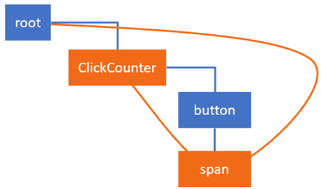
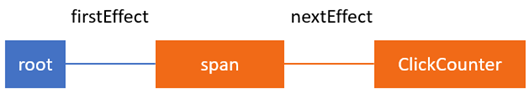
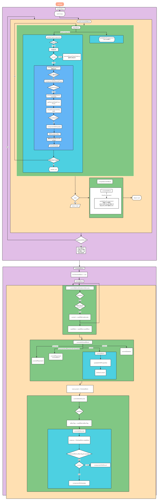

# React源码解析之state和props的更新

在前一篇文章《React源码解析之协调算法（reconciliation）》中，为理解本文的更新过程的细节提供了基础。

之前已经概述了在本文中要到用的主要数据结构和概念，特别是fiber节点、`current`树和 `work-in-progress`树、副作用和副作用列表。还讲解了协调算法主要内容，并解释了`render`和`commit`阶段之间的区别。如果你还没有读过，建议你先阅读[《React源码解析之协调算法（reconciliation）》]。

## 示例

上篇文章还使用到了一个示例，其中有一个按钮，它可以简单地增加屏幕上的数字：

```js
class ClickCounter extends React.Component {
    constructor(props) {
        super(props);
        this.state = {count: 0};
        this.handleClick = this.handleClick.bind(this);
    }

    handleClick() {
        this.setState((state) => {
            return {count: state.count + 1};
        });
    }

    componentDidUpdate() {}

    render() {
        return [
            <button key="1" onClick={this.handleClick}>Update counter</button>,
            <span key="2">{this.state.count}</span>
        ]
    }
}
```
这是一个简单的组件，从`render`方法返回两个子元素`button`和`span`。

与之前的示例不同的是，为了演示React如何在提交阶段添，这个示例还向组件添加了componentDidUpdate生命周期方法。

在本文中，将要讲解React如何处理`state`更新和构建副作用列表。我们会了解到渲染和提交阶段的函数中发生了什么。

尤其是，是[completeWork](https://github.com/facebook/react/blob/cbbc2b6c4d0d8519145560bd8183ecde55168b12/packages/react-reconciler/src/ReactFiberCompleteWork.js#L532)函数，它的主要步骤如下：

+ 更新 `ClickCounter` 组件`state`中的`count`熟悉
+ 调用 `render` 获取子元素列表并进行对比
+ 更新 `span` 的 `props`

和 [commitRoot](https://github.com/facebook/react/blob/95a313ec0b957f71798a69d8e83408f40e76765b/packages/react-reconciler/src/ReactFiberScheduler.js#L523)函数:

它的主要步骤如下：

+ 更新`span`的textContent属性

+ 调用componentDidUpdate

此之前，我们先快速了解一下在点击事件中调用setState时，react是怎么进行调度的。

## 调度更新

当我们点击按钮时，React执行传给按钮`props`的回调。在示例中，它只是增加计数器并更新状态：

```js
class ClickCounter extends React.Component {
    ...
    handleClick() {
        this.setState((state) => {
            return {count: state.count + 1};
        });
    }
}
```

每个React组件都有一个对应的`updater`，`updater`是组件和React核心之间的桥梁。由于有`updater`这个桥梁，所以ReactDOM、React Native、服务器端渲染和`testing utilities`就可以以不同的方式实现setState。

在本文中，我们只研究ReactDOM中`updater`对象的实现，它使用的是Fiber reconciler。对于ClickCounter组件，它是[classComponentUpdater](https://github.com/facebook/react/blob/6938dcaacbffb901df27782b7821836961a5b68d/packages/react-reconciler/src/ReactFiberClassComponent.js#L186)。它负责获取Fiber实例、等候更新进入队列和调度。

当更新进入队列时，它们只是被添加到更新队列中，以便在Fiber节点上处理。与ClickCounter组件对应的Fiber节点就会变成以下结构：

```js
{
    stateNode: new ClickCounter,
    type: ClickCounter,
    updateQueue: {
         baseState: {count: 0}
         firstUpdate: {
             next: {
                 payload: (state) => { return {count: state.count + 1} }
             }
         },
         ...
     },
     ...
}
```

updateQueue.firstUpdate.next中的函数payload就是我们传递给ClickCounter组件中setState的回调。它表示渲染阶段需要处理的第一个更新。


## 处理ClickCounter Fiber节点的更新

在上一篇文章中关于`work loop`的章节解释了nextUnitOfWork全局变量的作用。它保存了对workInProgress树中有一些需要改动的Fiber节点的引用。当React遍历Fibers树时，它使用这个变量来确定是否还有其他未完成工作的Fibers节点。

我们假设`setState`方法已被调用。React将setState的回调添加到`ClickCounter`的fiber节点上的`updateQueue`，并进行调度工作。React进入`render`阶段。它使用[renderRoot](https://github.com/facebook/react/blob/95a313ec0b957f71798a69d8e83408f40e76765b/packages/react-reconciler/src/ReactFiberScheduler.js#L1132)函数从最顶层的HostRoot Fiber节点开始遍历。但是，它会跳过已处理的Fiber节点，直到找到未完成工作的节点。此时，只有一个fiber节点需要做一些工作。它是ClickCounter的fiber节点。

所有工作都在该fiber节点的克隆副本上执行，并存储在`alternate`字段中。如果尚未创建`alternate`节点，则React会在处理更新之前在函数`createWorkInProgress`中创建副本。假设变量`nextUnitOfWork`包含对`ClickCounter`的替换 Fiber节点的引用。

## beginWork

首先，fiber进入beginWork函数

:::tip
由于树中的Fiber节点都会执行该函数，因此如果要调试render阶段，可以在此处放置断点。可以检查fiber节点的类型，以确定需要的节点。
:::

`beginWork`函数大体上是个大的`switch`语句，通过`tag`确定`Fiber`节点需要完成的工作类型，然后执行相应的函数来执行工作。在这个例子中，`CountClicks`是类组件，所以会走下例中分支：

```js
function beginWork(current$$1, workInProgress, ...) {
    ...
    switch (workInProgress.tag) {
        ...
        case FunctionalComponent: {...}
        case ClassComponent:
        {
            ...
            return updateClassComponent(current$$1, workInProgress, ...);
        }
        case HostComponent: {...}
        case ...
}
```

然后进入`updateClassComponent`函数。根据组件的首次渲染、正在恢复的工作还是更新，React要么创建实例并装载组件，要么只更新组件：

```js
function updateClassComponent(current, workInProgress, Component, ...) {
    ...
    const instance = workInProgress.stateNode;
    let shouldUpdate;
    if (instance === null) {
        ...
        // 在最初的过程中，可能需要构造实例。
        constructClassInstance(workInProgress, Component, ...);
        mountClassInstance(workInProgress, Component, ...);
        shouldUpdate = true;
    } else if (current === null) {
        // 已经有了一个可以重用的实例。
        shouldUpdate = resumeMountClassInstance(workInProgress, Component, ...);
    } else {
        shouldUpdate = updateClassInstance(current, workInProgress, ...);
    }
    return finishClassComponent(current, workInProgress, Component, shouldUpdate, ...);
}
```

## 处理ClickCounter Fiber更新

我们已经有了`ClickCounter`组件的实例，所以我们进入[updateClassInstance](https://github.com/facebook/react/blob/6938dcaacbffb901df27782b7821836961a5b68d/packages/react-reconciler/src/ReactFiberClassComponent.js#L976)。这就是React为类组件执行大部分工作的地方。以下是函数中按执行顺序执行的最重要的操作：

+ 调用`UNSAFE_componentWillReceiveProps()`钩子（已废弃）
+ 处理`updateQueue`中的更新以及生成新`state`
+ 使用新`state`调用`getDerivedStateFromProps`并得到结果
+ 调用`shouldComponentUpdate`确定组件是否需要更新；如果返回结果为`false`，跳过整个渲染过程，包括在该组件和它的子组件上调用`render`；否则继续更新
+ 调用`UNSAFE_componentWillUpdate`（已废弃）
+ 添加一个`effect`来触发`componentDidUpdate`生命周期钩子

::: tip
尽管调用componentDidUpdate的effect是在render阶段添加的，这个方法将在接下来的commit阶段执行。
:::

+ 更新组件实例的state和props 

组件实例的state和props应该在render方法调用前更新，因为render方法的输出通常依赖于state和props。如果我们不这样做，它每次都会返回一样的输出。

以下是函数的简化版本：

```js
function updateClassInstance(current, workInProgress, ctor, newProps, ...) {
    const instance = workInProgress.stateNode;

    const oldProps = workInProgress.memoizedProps;
    instance.props = oldProps;
    if (oldProps !== newProps) {
        callComponentWillReceiveProps(workInProgress, instance, newProps, ...);
    }

    let updateQueue = workInProgress.updateQueue;
    if (updateQueue !== null) {
        processUpdateQueue(workInProgress, updateQueue, ...);
        newState = workInProgress.memoizedState;
    }

    applyDerivedStateFromProps(workInProgress, ...);
    newState = workInProgress.memoizedState;

    const shouldUpdate = checkShouldComponentUpdate(workInProgress, ctor, ...);
    if (shouldUpdate) {
        instance.componentWillUpdate(newProps, newState, nextContext);
        workInProgress.effectTag |= Update;
        workInProgress.effectTag |= Snapshot;
    }

    instance.props = newProps;
    instance.state = newState;

    return shouldUpdate;
}
```

在上面的代码片段中删除了一些辅助代码。例如，在调用生命周期方法或添加`effects`来触发它们之前，React会使用typeof运算符检查组件是否实现了该方法。例如，下面是React在添加`effect`之前如何检查`componentDidUpdate`方法：

```js
if (typeof instance.componentDidUpdate === 'function') {
    workInProgress.effectTag |= Update;
}
```

现在我们知道在`render`阶段ClickCounter Fiber节点要执行哪些操作。现在，让我们看看这些操作如何更改firber节点上的值。当React开始运行时，ClickCounter组件的fiber节点如下所示：

```js
{
    effectTag: 0,
    elementType: class ClickCounter,
    firstEffect: null,
    memoizedState: {count: 0},
    type: class ClickCounter,
    stateNode: {
        state: {count: 0}
    },
    updateQueue: {
        baseState: {count: 0},
        firstUpdate: {
            next: {
                payload: (state, props) => {…}
            }
        },
        ...
    }
}
```
运行完成后，我们得到一个长这样的Fiber节点：

```js
{
    effectTag: 4, // Update副作用标记
    elementType: class ClickCounter,
    firstEffect: null,
    memoizedState: {count: 1},
    type: class ClickCounter,
    stateNode: {
        state: {count: 1}
    },
    updateQueue: {
        baseState: {count: 1},
        firstUpdate: null,
        ...
    }
}

```

更新后，`memoizedState`和`updateQueue`中`baseState`的属性`count`的值变为`1`。React也更新了`ClickCounter`组件实例的`state`。

至此，队列中不再有更新，所以`firstUpdate`为null。更重要的是，改变了`effectTag`属性。它不再是0，它的是为4。 二进制为100，意味着第三位被设置了，代表Update[副作用标记](https://github.com/facebook/react/blob/b87aabdfe1b7461e7331abb3601d9e6bb27544bc/packages/shared/ReactSideEffectTags.js)：

```js
export const Update = 0b00000000100;
```

综上所述，当处理ClickCounter Fiber节点时，React调用`pre-mutation`生命周期方法，更新状态并定义相关的副作用。

## 协调 ClickCounter fiber的子组件

接着，React进入[finishClassComponent](https://github.com/facebook/react/blob/340bfd9393e8173adca5380e6587e1ea1a23cefa/packages/react-reconciler/src/ReactFiberBeginWork.js#L355)。这是调用组件实例render方法和在子组件上使用diff算法的地方。[文档中](https://zh-hans.reactjs.org/docs/reconciliation.html)对此有介绍。以下是相关部分：

:::tip
当对比两个相同类型的 React 元素时，React 会保留 DOM 节点，仅比对及更新有改变的属性
:::

然而，如果我们深入研究，我们可以了解到它实际上是将Fiber节点与React元素进行了比较。

:::tip
如果你想自己学习细节，请查看[reconcileChildrenArray](https://github.com/facebook/react/blob/95a313ec0b957f71798a69d8e83408f40e76765b/packages/react-reconciler/src/ReactChildFiber.js#L732)函数，因为在我们的程序中render方法返回一个React元素数组。
:::

至此，有两件事需要理解。

**首先**，当React进行子协调时，它会为从`render`行数返回的子React元素创建或更新Fiber节点。`finishClassComponent`函数返回对当前Fiber节点第一个子节点的引用。它将赋值给`nextUnitOfWork`，稍后在工作循环中处理。

**其次**，React更新子节点的`props`作为父节点执行的一部分work。为此，它使用render函数返回的React元素的数据。

举例来说，这是React协调ClickCounter Fiber子节点之前span元素对应的Fiber节点看起来的样式

```js
{
    stateNode: new HTMLSpanElement,
    type: "span",
    key: "2",
    memoizedProps: {children: 0},
    pendingProps: {children: 0},
    ...
}
```
可以看到，`memoizedProps`和`pendingProps`的`children`属性都是0。

这是`render`函数返回的`span`元素对应的React元素的结构。

```js
{
    $$typeof: Symbol(react.element)
    key: "2"
    props: {children: 1}
    ref: null
    type: "span"
}
```

Fiber节点中的`props`和返回的React元素之间存在差异。在用于创建fiber替换节点的`createWorkInProgress`函数中，**React把要更新的属性从React元素复制到fiber节点**。

因此，在React完成ClickCounter组件子协调后，span Fiber节点的pendingProps更新了。它们就变成与span React元素中props的值一样。


```js
{
    stateNode: new HTMLSpanElement,
    type: "span",
    key: "2",
    memoizedProps: {children: 0},
    pendingProps: {children: 1},
    ...
}
```

之后，当React为span Fiber节点执行work时，将把它们复制到memoizedProps并添加effects来更新DOM。

这就是React在`render`阶段，`ClickCounter fiber`节点执行的所有工作。

由于按钮是`ClickCounter`组件的第一个子组件，它将被分配给`nextUnitOfWork`变量但无需对其进行任何操作。因此，React将移动到其同级节点，即span fiber节点。这个过程发生在`completeUnitOfWork`函数中。

## 处理Span fiber的更新

因此，变量`nextUnitOfWork`现在指向span fiber的`alternate`，React基于它开始工作。与为`ClickCounter`执行的步骤类似，我们从`beginWork`函数开始。

因为span节点是`HostComponent`类型，所以这次在`switch`语句中React采用以下分支：

```js
function beginWork(current$$1, workInProgress, ...) {
  ...
  switch (workInProgress.tag) {
    case FunctionalComponent: {...}
    case ClassComponent: {...}
    case HostComponent:
      return updateHostComponent(current, workInProgress, ...);
    case ...
}
```

返回[updateHostComponent](https://github.com/facebook/react/blob/cbbc2b6c4d0d8519145560bd8183ecde55168b12/packages/react-reconciler/src/ReactFiberBeginWork.js#L686)函数。（在这个函数内）你可以看到一系列和类组件调用的updateClassComponent函数类似的函数。对于函数组件是`updateFunctionComponent`。你可以在[ReactFiberBeginWork.js](https://github.com/facebook/react/blob/1034e26fe5e42ba07492a736da7bdf5bf2108bc6/packages/react-reconciler/src/ReactFiberBeginWork.js)文件中找到这些函数。

## 协调Span fiber子节点

在我们的例子中，span节点在updateHostComponent里没什么事发生。

## 完成Span Fiber节点的work

`beginWork`完成后，节点进入`completeWork`函数。但在此之前，React需要更新span fiber上的`memoizedProps`。您可能还记得，在协调`ClickCounter`组件的子组件时，React更新了span Fiber节点上的pendingProps：

```js
{
    stateNode: new HTMLSpanElement,
    type: "span",
    key: "2",
    memoizedProps: {children: 0},
    pendingProps: {children: 1},
    ...
}
```

所以一旦`span` fiber的`beginWork`完成，React会将pendingProps同步到memoizedProps。

```js
function performUnitOfWork(workInProgress) {
    ...
    next = beginWork(current$$1, workInProgress, nextRenderExpirationTime);
    workInProgress.memoizedProps = workInProgress.pendingProps;
    ...
}
```

然后调用的`completeWork`和我们看过的`beginWork`相似，基本上是一个大的switch语句。


```js
function completeWork(current, workInProgress, ...) {
    ...
    switch (workInProgress.tag) {
        case FunctionComponent: {...}
        case ClassComponent: {...}
        case HostComponent: {
            ...
            updateHostComponent(current, workInProgress, ...);
        }
        case ...
    }
}
```

因为 `span` fiber节点是`HostComponent`，所以它运行[`updateHostComponent`](https://github.com/facebook/react/blob/cbbc2b6c4d0d8519145560bd8183ecde55168b12/packages/react-reconciler/src/ReactFiberBeginWork.js#L686)函数。在这个函数中，React大至上执行以下操作：


+ 准备DOM更新
+ 把它们加到`span` fiber的`updateQueue`
+ 添加effect用于更新DOM

在这些操作执行前，`span` Fiber节点看起来像这样：

```js
{
    stateNode: new HTMLSpanElement,
    type: "span",
    effectTag: 0
    updateQueue: null
    ...
}
```

works完成后它看起来像这样：

```js

{
    stateNode: new HTMLSpanElement,
    type: "span",
    effectTag: 4,
    updateQueue: ["children", "1"],
    ...
}
```

注意`effectTag`和`updateQueue`字段的差异。它不再是0，它的值是4。用二进制表示是100，也就是设置了第3位，正是`Update`副作用的标志位。这是React在接下来的`commit`阶段对这个节点要做的唯一任务。`updateQueue`保存着用于更新的载荷。

一旦React处理完 `ClickCounter` 以及它的子节点，`render`阶段就结束了。接着就可以将完成的替换树赋值给FiberRoot的finishedWork属性。这是需要被刷新到屏幕上的新树。它可以在render阶段后立即处理，也可以在浏览器给React时间后再处理。

## Effects 列表

在例子中，由于span节点和ClickCounter组件有副作用，React将向`Host` Fiber的`firstEffect`属性添加指向span Fiber节点的链接。

React在[completeUnitOfWork](https://github.com/facebook/react/blob/d5e1bf07d086e4fc1998653331adecddcd0f5274/packages/react-reconciler/src/ReactFiberScheduler.js#L999)函数中构建 `effects` 列表。下面是具有更新`span`节点文本和调用ClickCounter `hooks` 效果的Fiber树的样子：

;

下面是具有effects的节点的线性列表：

;


## 提交阶段

这个阶段从函数[completeRoot](https://github.com/facebook/react/blob/95a313ec0b957f71798a69d8e83408f40e76765b/packages/react-reconciler/src/ReactFiberScheduler.js#L2306)开始。在开始执行任何工作之前，它会将FiberRoot上的`finishedWork`属性设置为null：

```js
root.finishedWork = null;
```

与`render`阶段不同，提交阶段始终是同步的，这样它可以安全地更新`HostRoot`来表示commit work开始了。

`commit`阶段是React更新DOM和调用改动后的生命周期方法componentDidUpdate的地方。为此，它遍历在render阶段中构建的effects 列表并应用它们。

我们在`render`阶段为`span`和ClickCounter节点定义了以下效果：

```js
{ type: ClickCounter, effectTag: 5 }
{ type: 'span', effectTag: 4 }
```

`ClickCounter`的effect tag的值是5或二进制的101，对于类组件来说这就意味着被标记为`Update` effect，表示需要执行componentDidUpdate生命周期方法。最低位也被设置了，表示该Fiber节点在render阶段的所有工作都已完成。

span的effect标记的值为4或100（二进制），表示host component 需要进行DOM更新工作。对于span元素，React需要更新元素的textContent。

## 应用 effects

让我们看看React是如何应用这些 `effect` 的。用于应用 `effect` 的函数[commitRoot](https://github.com/facebook/react/blob/95a313ec0b957f71798a69d8e83408f40e76765b/packages/react-reconciler/src/ReactFiberScheduler.js#L523)由3个子函数组成：

```js
function commitRoot(root, finishedWork) {
  commitBeforeMutationLifecycles()
  commitAllHostEffects();
  root.current = finishedWork;
  commitAllLifeCycles();
}
```

每个子函数都是一个循环，循环遍历`effects`列表并检查这些`effects`的类型。当发现effect和函数的目的有关时就应用它，就会应用它。在例子中，它会调用`ClickCounter`组件上的`componentDidUpdate`生命周期方法，并更新span元素的文本。

第一个函数[`commitBeforeMutationLifeCycles`](https://github.com/facebook/react/blob/fefa1269e2a67fa5ef0992d5cc1d6114b7948b7e/packages/react-reconciler/src/ReactFiberCommitWork.js#L183) 查找[Snapshot](https://link.juejin.cn/?target=https%3A%2F%2Fgithub.com%2Ffacebook%2Freact%2Fblob%2Fb87aabdfe1b7461e7331abb3601d9e6bb27544bc%2Fpackages%2Fshared%2FReactSideEffectTags.js%23L25 ) effect并调用`getSnapshotBeforeUpdate`方法。但是，由于没有在`ClickCounter`组件上实现该方法，React没有在渲染阶段添加effect。所以在我们的例子中，这个函数什么也不做。

## DOM更新

解析 React执行[commitAllHostEffects](https://github.com/facebook/react/blob/95a313ec0b957f71798a69d8e83408f40e76765b/packages/react-reconciler/src/ReactFiberScheduler.js#L376)函数。这就是React将span元素上的文本从`0`更改为`1`的地方。`ClickCounter` fiber 没有任何改动，因为类组件的节点没有任何DOM更新。

这个函数主要就是选择正确类型的`effect`并应用相应的操作。在例子中需要更新`span`元素的文本，所以我们采用`Update`分支：
```js
function commitAllHostEffects() {
    switch (primaryEffectTag) {
      case Placement: {...}
      case PlacementAndUpdate: {...}
      case Update:
        {
          var current = nextEffect.alternate;
          commitWork(current, nextEffect);
          break;
        }
      case Deletion: {...}
    }
}
```

通过深入到commitWork，我们将最终进入[updateDOMProperties](https://github.com/facebook/react/blob/8a8d973d3cc5623676a84f87af66ef9259c3937c/packages/react-dom/src/client/ReactDOMComponent.js#L326)函数。它会把渲染阶段添加的updateQueue有效负载带到Fiber节点，并更新span元素上的textContent属性：

```js
function updateDOMProperties(domElement, updatePayload, ...) {
  for (let i = 0; i < updatePayload.length; i += 2) {
    const propKey = updatePayload[i];
    const propValue = updatePayload[i + 1];
    if (propKey === STYLE) { ...} 
    else if (propKey === DANGEROUSLY_SET_INNER_HTML) {...} 
    else if (propKey === CHILDREN) {
      setTextContent(domElement, propValue);
    } else {...}
  }
}
```

应用DOM更新后，React将`finishedWork`树分配给`HostRoot`。将替换树设置为当前树：

```js
root.current = finishedWork;
```

## 调用变动后后生命周期hooks

剩下的最后一个函数是[commitAllLifecycles](https://github.com/facebook/react/blob/d5e1bf07d086e4fc1998653331adecddcd0f5274/packages/react-reconciler/src/ReactFiberScheduler.js#L479)。在这里，React调用变动后生命周期方法。在`render`阶段，React将`Update` effect 添加到`ClickCounter`组件。这是函数`commitAllLifecycles`查找并调用`componentDidUpdate`方法的effect之一：

```js
function commitAllLifeCycles(finishedRoot, ...) {
    while (nextEffect !== null) {
        const effectTag = nextEffect.effectTag;

        if (effectTag & (Update | Callback)) {
            const current = nextEffect.alternate;
            commitLifeCycles(finishedRoot, current, nextEffect, ...);
        }
        
        if (effectTag & Ref) {
            commitAttachRef(nextEffect);
        }
        
        nextEffect = nextEffect.nextEffect;
    }
}
```

`commitAllLifeCycles`函数也会更新refs，该过程在[commitLifeCycles](https://github.com/facebook/react/blob/e58ecda9a2381735f2c326ee99a1ffa6486321ab/packages/react-reconciler/src/ReactFiberCommitWork.js#L351)函数中执行，但由于我们没有任何此功能，因此不会调用。

```js
function commitLifeCycles(finishedRoot, current, ...) {
  ...
  switch (finishedWork.tag) {
    case FunctionComponent: {...}
    case ClassComponent: {
      const instance = finishedWork.stateNode;
      if (finishedWork.effectTag & Update) {
        if (current === null) {
          instance.componentDidMount();
        } else {
          ...
          instance.componentDidUpdate(prevProps, prevState, ...);
        }
      }
    }
    case HostComponent: {...}
    case ...
}
```

也可以看出，这是首次渲染时React调用componentDidMount方法的函数。

最后附上大致的流程图：


