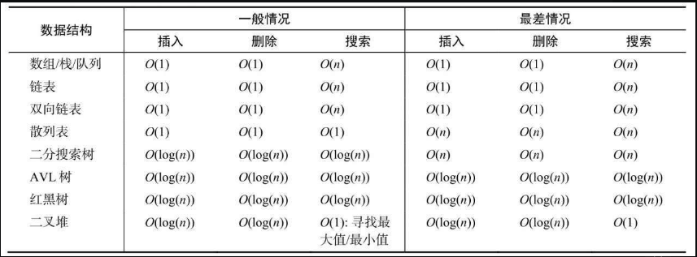

# 算法复杂度

## 时间复杂度

一个算法的时间复杂度反映了程序运行从开始到结束所需要的时间。把算法中基本操作重复执行的次数（频度）作为算法的时间复杂度。通过CPU（时间）占用来衡量。

1. O(1)

考虑以下代码：

```js
  function increment(num){      
    return ++num;    
  }
```

假设运行increment(1)函数，执行时间等于X。再运行increment(2)，执行时间依然是X。

和参数无关，increment函数的性能都一样。

因此，我们说上述函数的复杂度是O(1)（常数）。

2. O(n)

以顺序搜索算法为例。

```js
function search(arr, v, equal = default) {
  for (let i = 0; i < array.length; i++) {
    if (equal(value, array[i])) { // {1}
      return i;
    }
  }
  return -1;
}
```
数组的位数决定了这个函数的执行开销。

假如，我们要搜索11，那么 行{1} 就要执行10次。
如果行{1}运行一次的开销是1，那么它执行10次就是10。

可以得出search函数的执行开销是由输入的数组的长度决定的，所以时间复杂度是O(n)，n是输入的数组的长度。

3. O(n^2)

```js
function bubbleSort(arr, compare = defaultCompare) {
  const { length } = arr;
  let cost = 0;
  for (let i = 0; i < length; i++) {
    cost++;
    for(let j = 0; j < length - 1; j++) {
      cost++;
      if (compare(arr[j], arr[j + 1] === Compare.BIGGER_THAN)) {
        swap(arr, j, j + 1)
      }
    }
  }
 console.log(`输入数组长度： ${length}， 排序算法的消耗是 ${cost}`); 
}
```
如果用大小为10的数组执行bubbleSort，开销是100（10^2）。

::: tip
时间复杂度O(n)的代码只有一层循环，而O(n^2)的代码有双层嵌套循环。如果算法有三层迭代数组的嵌套循环，它的时间复杂度很可能就是O(n^3)
:::

### 时间复杂度比较

以下是时间复杂度表格。


基于上表信息画一个图来表示不同的大O表示法的消耗。


(大O速查表)[https://www.bigocheatsheet.com/]

下表是常用数据结构的时间复杂度。


下表是图的时间复杂度。


下表是排序算法的时间复杂度。


下表是搜索算法的时间复杂度。


##  空间复杂度

一个程序的空间复杂度是指运行完一个程序所需内存的大小。利用程序的空间复杂度，可以对程序的运行所需要的内存多少有个预先估计。
一个程序执行时除了需要存储空间和存储本身所使用的指令、常数、变量和输入数据外，还需要一些对数据进行操作的工作单元和存储一些为现实计算所需信息的辅助空间。

